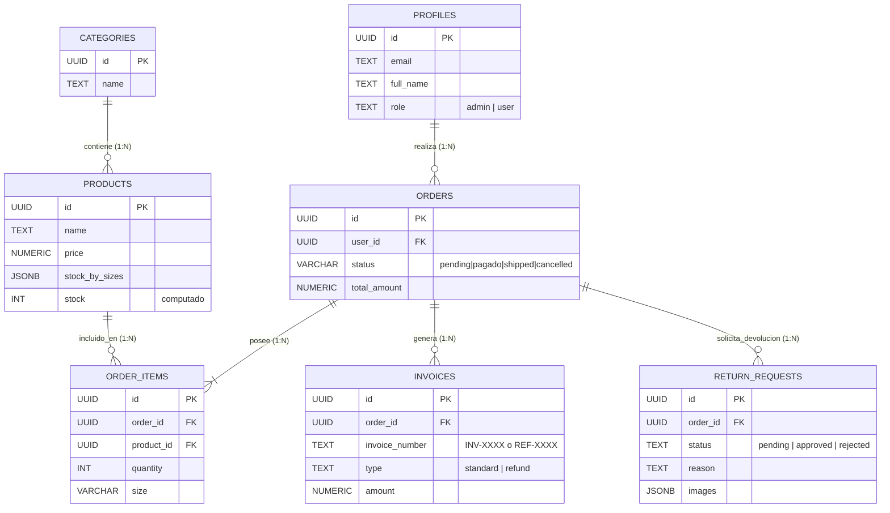

# 🛍️ FashionStore - E-commerce Enterprise Platform


FashionStore es una plataforma de comercio electrónico orientada a ofrecer una experiencia premium de usuario. Desarrollada bajo los principios **SOLID** y lineamientos de seguridad **OWASP**, la arquitectura se basa en un esquema Híbrido (SSG + SSR) que asegura métricas de SEO inmejorables junto a una escalabilidad comercial segura.

---

## 🌟 Características Principales (UX/UI & Funcionalidad)

- **Island Architecture Estricta**: Páginas estáticas optimizadas al milisegundo mediante generación de sitio estático (SSG), integrando islas dinámicas (React + Nano Stores) para persistir el carrito entre navegaciones sin bloquear la interfaz.
- **Diseño Premium Minimalista**: Paleta estética "brutalista-limpia" en formato responsivo y Mobile-First, utilizando TailwindCSS y configurando transiciones en CSS Vanilla para potenciar la aceleración por hardware.
- **Buscador en Tiempo Real (Live Search)**: Interfaz de filtrado inteligente desacoplada del _Document Object Model_ para indexar eficientemente categorías corporativas, marcas y perfiles de tallas.
- **Recomendador Inteligente de Tallas**: Algoritmo modal algorítmico diseñado en una Isla React para sugerir a los clientes su talla basándose en sus métricas morfológicas (peso/altura).
- **Procesamiento Legal Integral**: Generación dinámica y atómica de **Facturas (Invoices)** con soporte visual PDF/HTML. Expide facturas rectificativas o Abonos al devolver una prenda o tramitar cancelaciones, manteniendo el libro contable de la tienda inmaculado de cara al Fisco.
- **Ecosistema Móvil Nativo**: Aplicación Flutter integrada que replica toda la lógica de negocio, pasarelas de pago y sincronización de favoritos en tiempo real.

---

## 📱 Mobile Application (Flutter)

El ecosistema CROMA cuenta con una aplicación móvil dedicada diseñada para ofrecer la mejor experiencia en dispositivos iOS y Android:

- **Sincronización Total**: Favoritos y perfiles compartidos con la web a través de Supabase.
- **Admin Portal Móvil**: Panel de control industrial para gestionar el inventario y pedidos desde cualquier lugar.
- **Diseño Ultra-Premium**: Animaciones `scroll-fading` y micro-interacciones de alto nivel.
- **Repositorio**: [CROMA_APP](https://github.com/astralk9999/CROMA_APP)

---

## 💻 Tech Stack & Arquitectura de Software

La aplicación descansa en pilares modernos, abandonando MVC tradicionales por ecosistemas Headless:

- **Frontend Core**: [Astro 5](https://astro.build/) configurado en modo _Output: Hybrid_.
- **Estado Dinámico**: [Nanostores](https://github.com/nanostores/nanostores) en conjunto con componentes inyectados de *React*.
- **Database & Auth**: [Supabase](https://supabase.com/). Motor PostgreSQL blindado con Row-Level-Security (RLS).
- **Pasarela de Pago**: [Stripe Checkout Webhooks](https://stripe.com/).
- **Almacenamiento CDN**: [Cloudinary](https://cloudinary.com) Unsigned Presets asíncronos para evitar fugas de secrets en archivos del front-end.
- **Transacciones Email**: [Resend / Brevo](https://resend.com) integrado para disparos operacionales.

### Justificación de Arquitectura SSG/SSR
La web está dividida matemáticamente:
1. **SSG (Static Site Generation)**: El núcleo comercial, las páginas de productos (`/productos/[slug]`) y la portada (`/index.astro`). Almacenadas en CDN para lograr TTFB latencia casi nula, imprescindible para SEO.
2. **SSR (Server-Side Rendering)**: Pasarelas de Checkout, Carrito y el panel Backoffice de Administrador (`prerender = false`). El servidor levanta sesión JWT middleware verificando al cliente al vuelo.

---

## 🔒 Seguridad (OWASP & ACID Compliance)

- **Transaccionalidad Atómica**: Prevención estricta al _Race Condition_. Si 2.000 clientes intentan comprar un zapato de stock unitario simultáneamente, fallarán elegantemente 1.999 mediante chequeos RPC del motor SQL (`decrement_stock`).
- **Devoluciones de Red (`RESTORE_STOCK`)**: Si el pago se cancela en la pasarela, el cliente abandona o el Backoffice anula un flujo logístico forzosamente, el código SQL reinyecta el artículo a su almacén físico y la base de persistencia de forma automática y auditable.
- **Protección Backend Middleware**: Blindaje masivo sobre prefijos `/api/admin/*`, negando lecturas sueltas y esquivando ataques N+1 de _querys_ saturantes en bases de datos.

---

## 🗄️ Esquema Conceptual (Base de Datos)

El corazón de la Tienda respeta normalización de alto nivel a través de Supabase garantizando un modelo lógico transparente.



---

## 🚀 Despliegue (Deploying)

El proyecto viene preparado internamente con su `.env` tipado adaptado para un servidor **VPS** en Node Standalone (compatible con Nginx / Coolify) o en la nube tradicional:

```bash
# 1. Instalar variables (copiar de ejemplo)
cp .env.example .env

# 2. Instalar dependencias puras
npm install

# 3. Compilar los binarios Híbridos al bundle /dist/
npm run build

# 4. Lanzar servidor nativo asíncrono en puerto
node ./dist/server/entry.mjs
```

---

> [!NOTE]  
> Este es un proyecto nivel Sénior auditado bajo heurísticas puras de revisión arquitectónica y revisiones en refactorización SOLID. 
