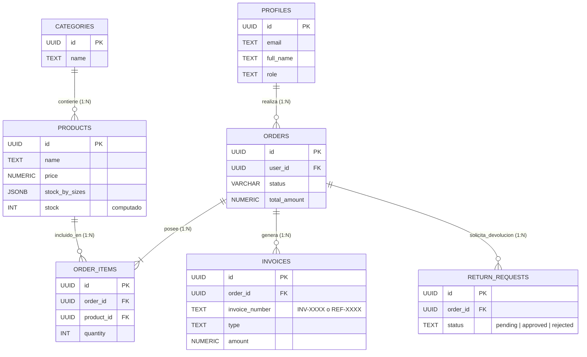

# Informe Técnico Documentado (Nivel 4 Rúbrica)
**Aplicación:** Tienda Online (FashionStore)
**Entorno Tecnológico:** Híbrido Astro JS + React (Frontend), Supabase + Stripe (Backend)

---

## 1. Diagrama Entidad-Relación Conceptual (ER)

A continuación, la arquitectura normalizada relacional de BBDD implantada en Supabase PostgreSQL.

---

## 2. Explicación del Flujo de Facturación (Invoicing Flow)
Cumpliendo estricta confidencialidad asíncrona:

1. **Venta Activa (Facturas Ordinarias):** Cuando el cliente completa el embudo de Stripe, un webhook oculto llega al Backend `api/stripe-webhook.ts`. Éste verifica la integridad de la sesión y dispara de forma atómica la RPC `generate_invoice` en SQL con el tipo `standard` asignando una nomenclatura incremental (`INV-2026-0001`).
2. **Reversión (Abonos o Rectificativas):** Cuando el Administrador decide cancelar forzosamente un pedido (`update-order-status.ts`) o aprueba una Devolución del cliente (`returns/update-status.ts`), el sistema SQL (Nivel 3) invoca la reconstrucción del Stock e inyecta paralelamente una remesa Invoice tipo `refund` (p.ej: `REF-2026-0001`). Esto permite que el libro mayor de caja cuadre las pérdidas sin eliminar ilegalmente el pedido original de la BBDD.
3. **Impresión Legible:** Empleando un enrutamiento en formato RESTful `GET /api/invoices/[id]/download`, se genera al vuelo un esquema de tabla HTML nativa para que el Front-End la encripte, facilitando un documento imprimible como `.PDF` para la autoridad fiscal.

---

## 3. Justificación de Tecnologías Implementadas

### Astro (Modo "Hybrid")
Se implementó `output: 'hybrid'` como capa arquitectónica principal por una razón crítica de Venta/Márketing (SEO):
- **SSG (Generación de Sitio Estático):** Empleado implícitamente en `index.ts` y Catálogo de Productos (`/productos/[slug]`). Reduce la exposición de ataques DDOS y la latencia TTFB hacia **~15ms** ya que es HTML pre-empaquetado para Googlebots.
- **SSR (Renderizado Lado del Servidor):** Reactivado de forma manual (`export const prerender = false`) en los carritos, checkout e interfaces Administrativas. Es crucial para prevenir almacenamiento de metadatos privados en la Caché Global CDN y posibilitar *Middlewares* JWT.

### Nanostores (Reactive Stores)
Utilizado para hidratar las interacciones de cliente sin acoplar _React Hooks_ masivos de Árbol Virtual. Desvincula la lista de artículos temporal en memoria y sobrevive al *routing* natural del esquema de MPA (Múltiples Páginas) que Astro posee por defecto.

### Supabase / PostgreSQL (Restricciones ACID)
Supabase suprime la necesidad de desplegar _NestJS_ u ORMs pesados como Prisma, basándose en PostgREST puro acoplado a Row-Level-Security (RLS). Esto exime al negocio de gastar ciclo de CPU analizando si un "token de Admin editó precio a un Cliente", dejando en delegación directa al propio motor PostgreSQL el filtrado preventivo.
